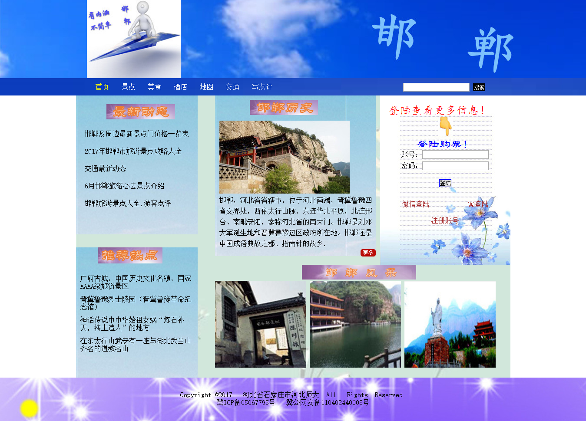
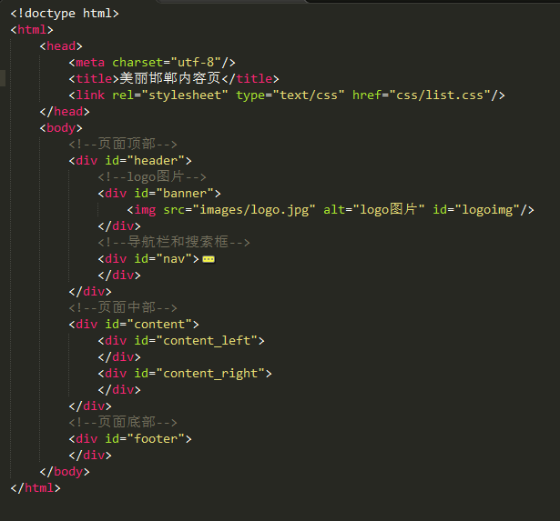

美丽邯郸旅游网站
================
设计目的
--------
1.    熟练掌握HTML在组织结构上的优势。
2.    熟练掌握CSS在网页布局中的应用。
3.    学习Web标准及浏览器的兼容性。

设计步骤
--------
<h4>1. 功能性需求分析</h4>
该网页共有7个页面，现在完成了3个，其中每一个页面的屏幕截图及主要功能如下所列。

（1）首页：

屏幕截图：

图1 首页屏幕截图

主要实现功能：

导航栏功能：可以实现不同页面之间的切换。有网站的logo。有搜索框，可以搜索一些关于邯郸旅游的一些信息。

主体部分：大体分为左右两个部分，左边有最新动态和推荐热点。最新动态可以给用户提供邯郸旅游的最新消息，推荐热点是给用户推荐一些比较热门的旅游景点。
右边部分有邯郸历史，介绍邯郸的历史，点击右下角的“更多”可以查看更多相关信息，有助于用户更好的了解邯郸。有表单，可以让用户注册账号或登陆账号，可以查看更多信息，可以对喜欢的景点进行收藏然后比较选择喜欢的地方。还有邯郸风采这是给用户展现一些邯郸景点的图片，让客户领略邯郸的风采。

底部：是网页的版权信息。

（2）列表页：

屏幕截图：

图2 列表页屏幕截图

主要实现功能：

导航栏功能：可以实现不同页面之间的切换。有网站的logo。有搜索框，可以搜索一些关于邯郸旅游的一些信息。

主体部分：主要分为两部分，左边有面包屑，显示当前位置。有邯郸景点列表，每个列表有图片和简单介绍，点击右下角的“详细”可以查看关于此景点的更详细的信息。
右边部分有推荐热点和登陆表单。推荐热点可供用户在浏览景点列表时参考哪个最热门。登陆表单可供用户快速登陆，及时买票，可以对喜欢的景点进行收藏然后比较选择喜欢的地方。

底部：是网页的版权信息。

（3）内容页：

屏幕截图：

图3 内容页屏幕截图

主要实现功能：

导航栏功能：可以实现不同页面之间的切换。有网站的logo。有搜索框，可以搜索一些关于邯郸旅游的一些信息。

主体部分：主要分为两部分，左边部分有面包屑，显示当前位置。有这个景点的详细介绍，可让用户清楚地了解这个景点。右边部分有推荐热点，登陆表单和评论留言区。推荐热点可供用户在参考哪些景点热门。登陆表单可供用户快速登陆，及时买票，可以对喜欢的景点进行收藏然后比较选择喜欢的地方。评论留言区可供用户对景点等进行评价，可以留言，可提一些建议。

底部：是网页的版权信息。

<h4>2.搜索网站素材</h4>

从网上搜索寻找相关邯郸旅游的一些信息和相关图片。利用美图秀秀等修图软件进行修图。

<h4>3.建立网站代码目录结构</h4>

图4 网站代码目录结构

<h4>4.编写HTML代码</h4>

（1）首页部分：

图5 首页html结构

（2）列表页部分：

图6 列表页html结构

（3）内容页部分：

图7 内容页html结构

<h4>5.编写CSS布局及样式</h4>

（1）CSS布局

核心技术：float实现布局，position辅助布局。

（2）添加CSS样式：

通用类属性：

*{

	margin:0px;
	
	padding:0px;
	
}

a{

	text-decoration:none;
	
	color:black;
	
}

a:hover{

	color:orange;
	
}

ul{

	list-style:none;
	
}

背景相关属性：background属性

字体相关属性：font

文本相关属性：text-align

盒子相关属性：padding    margin  width    height  border

<h4>6.调试浏览器兼容性：</h4>

(1)问题1：

在IE10+中的表现：

图8 兼容性问题 1 首页表单 IE

在火狐中的表现：

图9 兼容性问题 1 首页 火狐

在Chrome中的表现：

图10 兼容性问题 1 首页 谷歌

解决方案（核心源代码）：

图11 兼容性问题 1 解决方案

（2）问题2：

在360极速浏览器中的表现：

图12 浏览器兼容性问题2 360

在IE10+中的表现：

图13 浏览器兼容性问题2 IE

在火狐中的表现：

图14 浏览器兼容性问题2 火狐

在Chrome中的表现：

图15 浏览器兼容性问题2 谷歌

解决方案（核心源代码）：

图16 浏览器兼容性问题2 解决方案

问题记录
--------

1.问题表现：

主题背景图片不能正常显示，给body加高度后能正常显示。

2.问题表现：

导航栏中的搜索框的搜索按钮背景设为黑色时一直有问题，后来在input标签里设置id属性，问题解决。

设计总结
--------

1.需求分析阶段的经验：

清楚网站一共有几个页面，明确各个网页的功能，从用户角度出发，

2.编写HTML代码的经验：

先写HTML主体结构，使用div，将整个页面分为3个部分，顶部，主体部分和底部。

3.CSS布局的经验：

主要用float布局，可以用position辅助。有整体到局部。
先写上
*{
	margin:0px;
	padding:0px;
}

4.设置CSS样式经验：

先写上通用属性。

同时写height属性和line-height属性 可以使文字垂直居中。

用标签选择器、类选选择器、id选择器和派生选择器。

5.调整浏览器兼容性经验：

不同浏览器的标签的默认的外边距和内边距不同，在CSS里写*{margin:0px;padding:0px;} 。

其它兼容性问题可具体情况具体分析。

6.Sublime Text使用经验：

使用tab键缩进   Tab Size:4 。

课程小节
---------

1.HTML内容：

具体内容见文件夹中html文件

2.CSS内容：

具体内容见文件夹中CSS文件

3.网上参考的内容：

从网上参考一些邯郸旅游的相关信息，搜索相关图片。参考一些关于浏览器兼容性的问题。

4.浏览器对CSS的兼容性上的不同表现：

不同浏览器的标签的默认的外边距和内边距不同，在CSS里写*{margin:0px;padding:0px;} 。

其它兼容性问题可具体情况具体分析。

解决方案
--------

遇到问题通过查找相关资料或上网寻找解决方法。

参考文献
--------

1.CSS盒子模型及DIV布局

2.浏览器对CSS的兼容性：http://www.div-css.com/html/XHTML-CSS/hack/1136667.html http://www.divcss5.com/css-hack/c23.html http://www.divcss5.com/css-hack/
